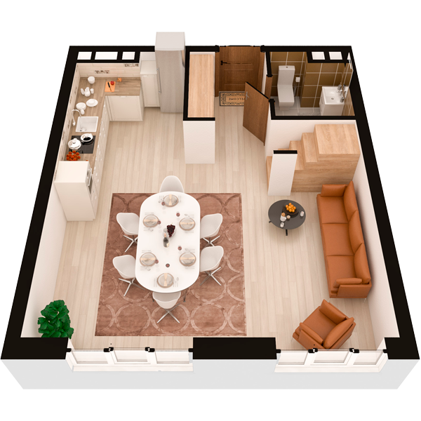

# План квартири 4c2

| Тип | Загальна площа | Житлова площа |
| --- | -------------- | ------------- |
| 4c2 | 120,36         | 61,03         |

| Приміщення       | Площа |
| ---------------- | ----- |
| 1.Кімната        | 13,62 |
| 2.Кухня-вітальня | 20,52 |
| 3.Ванна кімната  | 3,36  |
| 4.Передпокій     | 6,32  |

## План приміщення

<iframe src="plan.pdf" width="100%" height="620" style="border:none;"></iframe>

[⬇ Завантажити план приміщення](plan.pdf){ .md-button }

## План поверху

<iframe src="floor.pdf" width="100%" height="620" style="border:none;"></iframe>

[⬇ Завантажити план поверху](floor.pdf){ .md-button }