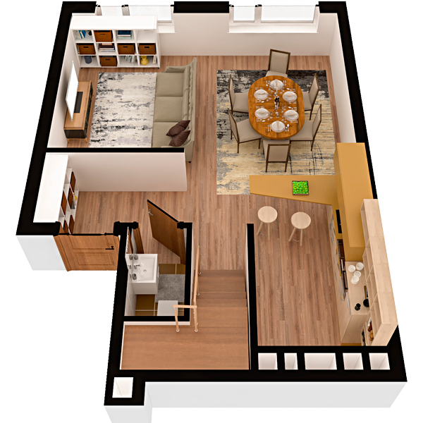

# План квартири 4c3

| Тип | Загальна площа | Житлова площа |
| --- | -------------- | ------------- |
| 4c3 | 139,03         | 62,99         |

| Приміщення       | Площа |
| ---------------- | ----- |
| 1.Кімната        | 10,75 |
| 2.Кухня-вітальня | 24,82 |
| 3.Ванна кімната  | 1,55  |
| 4.Передпокій     | 8,85  |

## 📁[План приміщення](plan.pdf)

## 📁[План поверху](floor.pdf)