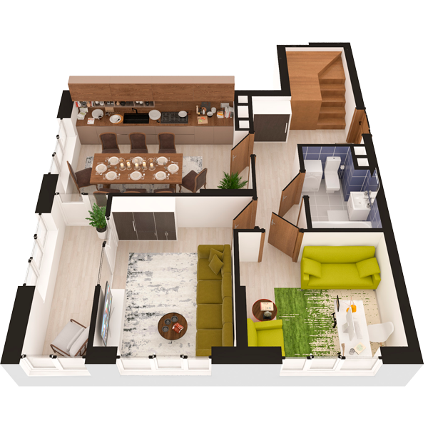

# План квартири 4c4

| Тип | Загальна площа | Житлова площа |
| --- | -------------- | ------------- |
| 4c4 | 109,49         | 47,69         |

| Приміщення                | Площа |
| ------------------------- | ----- |
| 1.Кімната                 | 13,36 |
| 2.Кімната                 | 10,47 |
| 3.Кухня-вітальня          | 18,23 |
| 4.Ванна кімната           | 4,48  |
| 5.Передпокій              | 13,62 |
| 6.Засклена лоджія (k=1,0) | 5,79  |

## План приміщення

<iframe src="plan.pdf" width="100%" height="620" style="border:none;"></iframe>

[⬇ Завантажити план приміщення](plan.pdf){ .md-button }

## План поверху

<iframe src="floor.pdf" width="100%" height="620" style="border:none;"></iframe>

[⬇ Завантажити план поверху](floor.pdf){ .md-button }