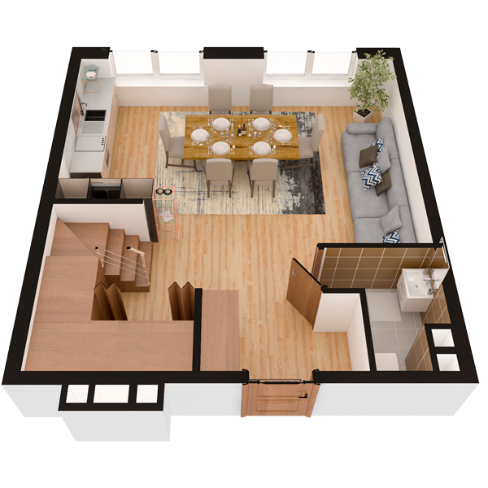

# План квартири 4k2

| Тип | Загальна площа | Житлова площа |
| --- | -------------- | ------------- |
| 4k2 | 134,07         | 70,45         |

| Приміщення   | Площа |
| ------------ | ----- |
| 1.Кімната    | 21,45 |
| 2.Кухня      | 8,43  |
| 3.Санвузол   | 3,09  |
| 4.Передпокій | 15,20 |

## План приміщення

<iframe src="plan.pdf" width="100%" height="620" style="border:none;"></iframe>

[⬇ Завантажити план приміщення](plan.pdf){ .md-button }

## План поверху

<iframe src="floor.pdf" width="100%" height="620" style="border:none;"></iframe>

[⬇ Завантажити план поверху](floor.pdf){ .md-button }