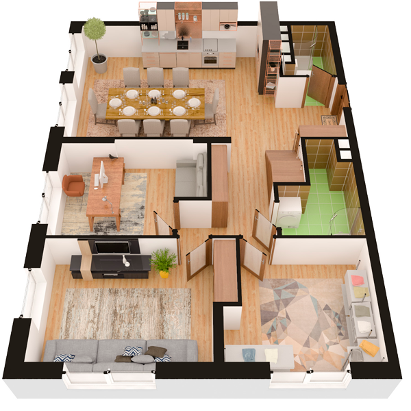

# План квартири 5c1

| Тип | Загальна площа | Житлова площа |
| --- | -------------- | ------------- |
| 5c1 | 152,30         | 69,94         |

| Приміщення      | Площа |
| --------------- | ----- |
| 1.Кімната       | 12,20 |
| 2.Кімната       | 15,12 |
| 3.Кімната       | 11,28 |
| 4.Кухня         | 29,88 |
| 5.Ванна кімната | 5,14  |
| 6.Санвузол      | 3,11  |
| 7.Коридор       | 14,36 |

## План приміщення

<iframe src="plan.pdf" width="100%" height="620" style="border:none;"></iframe>

[⬇ Завантажити план приміщення](plan.pdf){ .md-button }

## План поверху

<iframe src="floor.pdf" width="100%" height="620" style="border:none;"></iframe>

[⬇ Завантажити план поверху](floor.pdf){ .md-button }