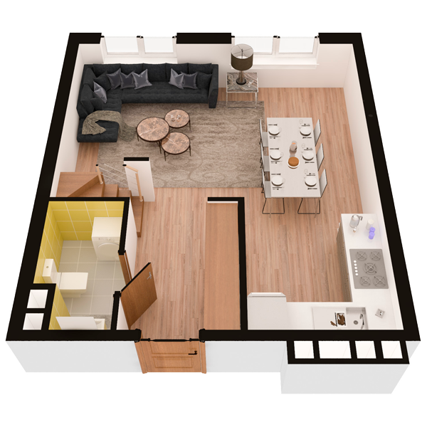

# План квартири 5c3

| Тип | Загальна площа | Житлова площа |
| --- | -------------- | ------------- |
| 5c3 | 170,98         | 78,27         |

| Приміщення       | Площа |
| ---------------- | ----- |
| 1.Кімната        | 14,27 |
| 2.Кухня-вітальня | 19,84 |
| 3.Санвузол       | 3,60  |
| 4.Передпокій     | 8,19  |

## План приміщення

<iframe src="plan.pdf" width="100%" height="620" style="border:none;"></iframe>

[⬇ Завантажити план приміщення](plan.pdf){ .md-button }

## План поверху

<iframe src="floor.pdf" width="100%" height="620" style="border:none;"></iframe>

[⬇ Завантажити план поверху](floor.pdf){ .md-button }