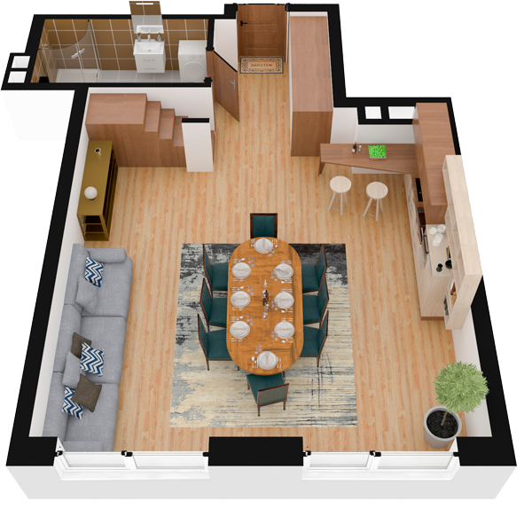

# План квартири 6k1

| Тип | Загальна площа | Житлова площа |
| --- | -------------- | ------------- |
| 6k1 | 177,97         | 100,33        |

| Приміщення       | Площа |
| ---------------- | ----- |
| 1.Кімната        | 27,87 |
| 2.Кухня-вітальня | 12,46 |
| 3.Санвузол       | 6,34  |
| 4.Передпокій     | 8,45  |

## 📁[План приміщення](plan.pdf)

## 📁[План поверху](floor.pdf)