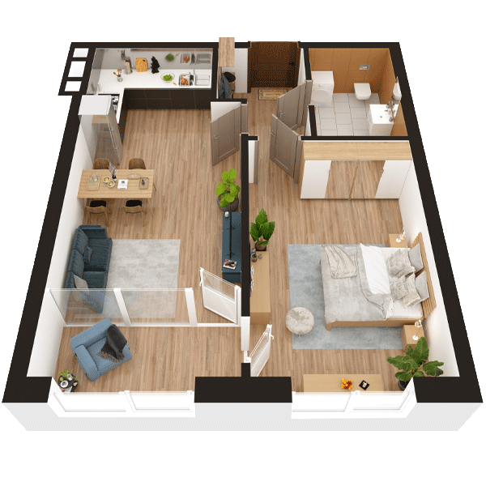

# План квартири 1C4

| Тип | Загальна площа | Житлова площа |
| --- | -------------- | ------------- |
| 1C4 | 43,73          | 13,94         |

| Приміщення                | Площа |
| ------------------------- | ----- |
| 1.Кімната                 | 13,94 |
| 2.Кухня-вітальня          | 17,11 |
| 3.Ванна кімната           | 4,39  |
| 4.Коридор                 | 4,01  |
| 5.Засклена лоджія (k=1,0) | 4,28  |

## 📁[План приміщення](plan.pdf)

## 📁[План поверху](floor.pdf)