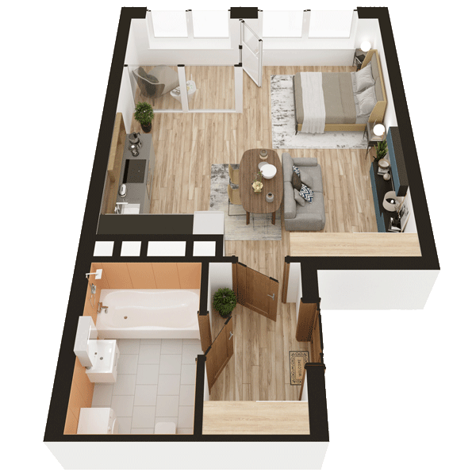

# План квартири 1K1

| Тип | Загальна площа | Житлова площа |
| --- | -------------- | ------------- |
| 1K1 | 37,38          | 17,35         |

| Приміщення                | Площа |
| ------------------------- | ----- |
| 1.Кімната                 | 17,35 |
| 2.Кухня                   | 8,77  |
| 3.Ванна кімната           | 4,52  |
| 4.Коридор                 | 3,68  |
| 5.Засклена лоджія (k=1,0) | 3,06  |

## 📁[План приміщення](plan.pdf)

## 📁[План поверху](floor.pdf)