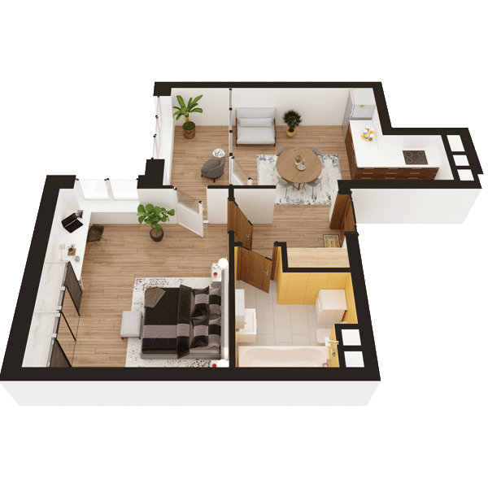

# План квартири 1K2

| Тип | Загальна площа | Житлова площа |
| --- | -------------- | ------------- |
| 1K2 | 40,38          | 14,10         |

| Приміщення                | Площа |
| ------------------------- | ----- |
| 1.Кімната                 | 14,10 |
| 2.Кухня                   | 13,91 |
| 3.Ванна кімната           | 4,31  |
| 4.Коридор                 | 3,82  |
| 5.Засклена лоджія (k=1,0) | 4,24  |

## 📁[План приміщення](plan.pdf)

## 📁[План поверху](floor.pdf)