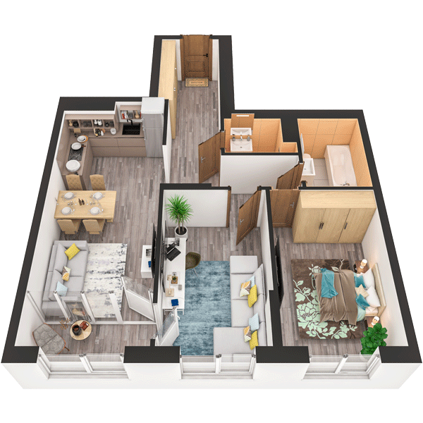

# План квартири 2C1

| Тип | Загальна площа | Житлова площа |
| --- | -------------- | ------------- |
| 2C1 | 76,52          | 27,55         |

| Приміщення                | Площа |
| ------------------------- | ----- |
| 1.Кімната                 | 14,04 |
| 2.Кімната                 | 13,51 |
| 3.Кухня-вітальня          | 21,40 |
| 4.Ванна кімната           | 5,26  |
| 5.Санвузол                | 2,57  |
| 6.Коридор                 | 15,32 |
| 7.Засклена лоджія (k=1,0) | 4,42  |

## 📁[План приміщення](plan.pdf)

## 📁[План поверху](floor.pdf)