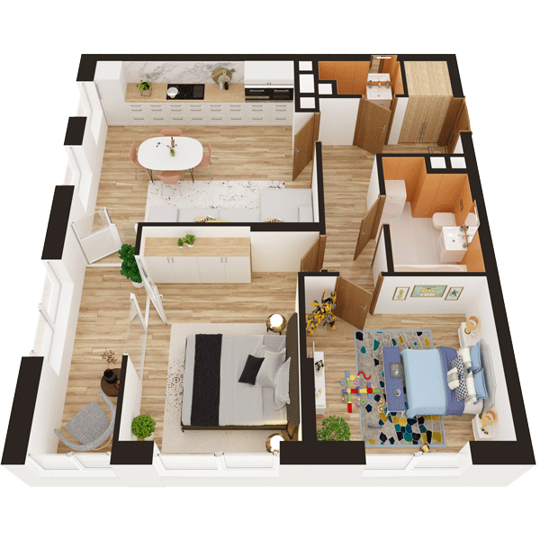

# План квартири 2C2

| Тип | Загальна площа | Житлова площа |
| --- | -------------- | ------------- |
| 2C2 | 68,22          | 24,35         |

| Приміщення                | Площа |
| ------------------------- | ----- |
| 1.Кімната                 | 13,57 |
| 2.Кімната                 | 10,78 |
| 3.Кухня-вітальня          | 22,14 |
| 4.Ванна кімната           | 4,57  |
| 5.Санвузол                | 1,83  |
| 6.Гардеробна              | 1,15  |
| 7.Коридор                 | 8,15  |
| 8.Засклена лоджія (k=1,0) | 6,03  |

## 📁[План приміщення](plan.pdf)

## 📁[План поверху](floor.pdf)