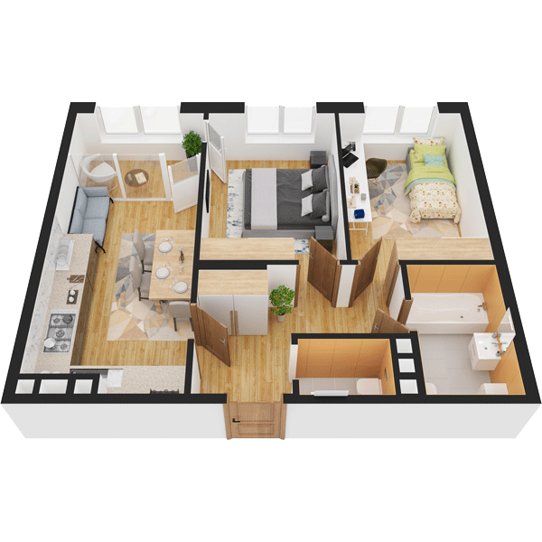

# План квартири 2C3

| Тип | Загальна площа | Житлова площа |
| --- | -------------- | ------------- |
| 2C3 | 62,61          | 25,57         |

| Приміщення                | Площа |
| ------------------------- | ----- |
| 1.Кімната                 | 13,01 |
| 2.Кімната                 | 12,56 |
| 3.Кухня-вітальня          | 17,04 |
| 4.Ванна кімната           | 5,09  |
| 5.Санвузол                | 1,98  |
| 6.Коридор                 | 8,75  |
| 7.Засклена лоджія (k=1,0) | 4,18  |

## 📁[План приміщення](plan.pdf)

## 📁[План поверху](floor.pdf)