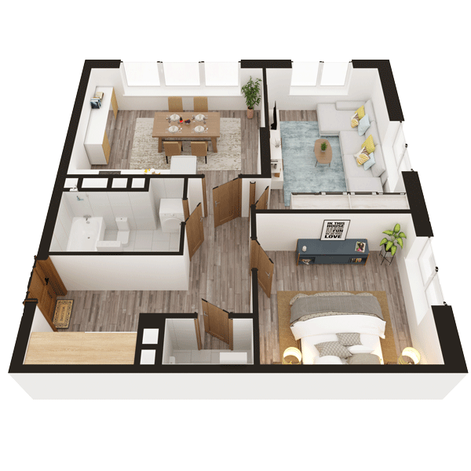

# План квартири 2C4

| Тип | Загальна площа | Житлова площа |
| --- | -------------- | ------------- |
| 2C4 | 67,32          | 29,51         |

| Приміщення       | Площа |
| ---------------- | ----- |
| 1.Кімната        | 16,46 |
| 2.Кімната        | 13,05 |
| 3.Кухня-вітальня | 19,09 |
| 4.Ванна кімната  | 5,15  |
| 5.Санвузол       | 1,68  |
| 6.Гардеробна     | 2,30  |
| 7.Коридор        | 9,59  |

## План приміщення

<iframe src="plan.pdf" width="100%" height="620" style="border:none;"></iframe>

[⬇ Завантажити план приміщення](plan.pdf){ .md-button }

## План поверху

<iframe src="floor.pdf" width="100%" height="620" style="border:none;"></iframe>

[⬇ Завантажити план поверху](floor.pdf){ .md-button }