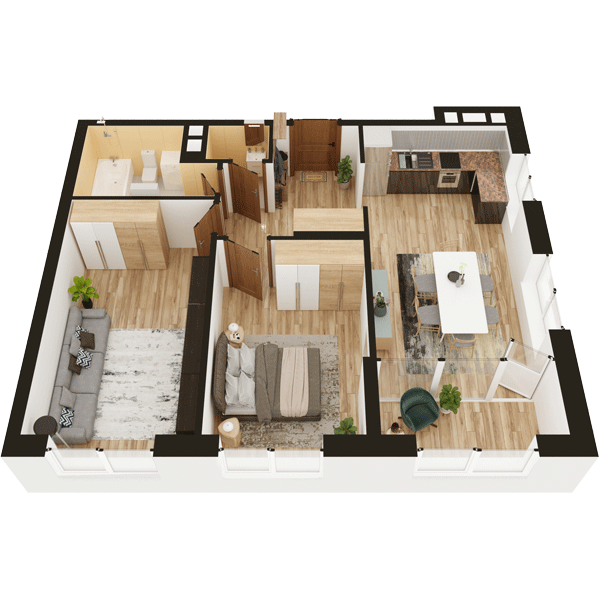

# План квартири 2C5

| Тип | Загальна площа | Житлова площа |
| --- | -------------- | ------------- |
| 2C5 | 63,30          | 26,74         |

| Приміщення                | Площа |
| ------------------------- | ----- |
| 1.Кімната                 | 14,98 |
| 2.Кімната                 | 11,76 |
| 3.Кухня-вітальня          | 18,19 |
| 4.Ванна кімната           | 5,01  |
| 5.Санвузол                | 1,31  |
| 6.Коридор                 | 7,72  |
| 7.Засклена лоджія (k=1,0) | 4,33  |

## 📁[План приміщення](plan.pdf)

## 📁[План поверху](floor.pdf)