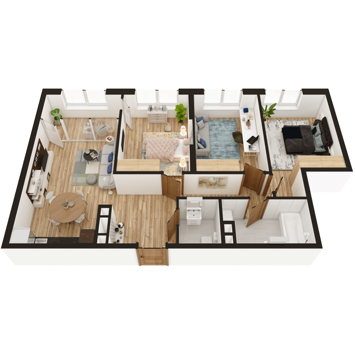

# План квартири 3C2

| Тип | Загальна площа | Житлова площа |
| --- | -------------- | ------------- |
| 3C2 | 82,23          | 38,85         |

| Приміщення                | Площа |
| ------------------------- | ----- |
| 1.Кімната                 | 13,73 |
| 2.Кімната                 | 12,82 |
| 3.Кімната                 | 12,30 |
| 4.Кухня-вітальня          | 19,38 |
| 5.Ванна кімната           | 5,44  |
| 6.Санвузол                | 2,67  |
| 7.Коридор                 | 11,16 |
| 8.Засклена лоджія (k=1,0) | 4,73  |

## 📁[План приміщення](plan.pdf)

## 📁[План поверху](floor.pdf)