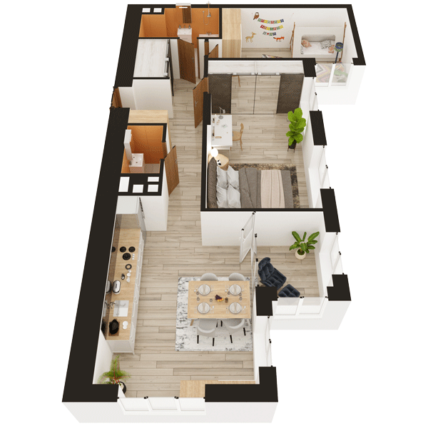

# План квартири 3K1

| Тип | Загальна площа | Житлова площа |
| --- | -------------- | ------------- |
| 3K1 | 85,62          | 47,89         |

| Приміщення                | Площа |
| ------------------------- | ----- |
| 1.Кімната                 | 22,43 |
| 2.Кімната                 | 15,43 |
| 3.Кімната                 | 10,03 |
| 4.Кухня                   | 11,00 |
| 5.Ванна кімната           | 5,09  |
| 6.Санвузол                | 2,35  |
| 7.Гардеробна              | 2,74  |
| 8.Коридор                 | 11,87 |
| 9.Засклена лоджія (k=1,0) | 4,68  |

## 📁[План приміщення](plan.pdf)

## 📁[План поверху](floor.pdf)