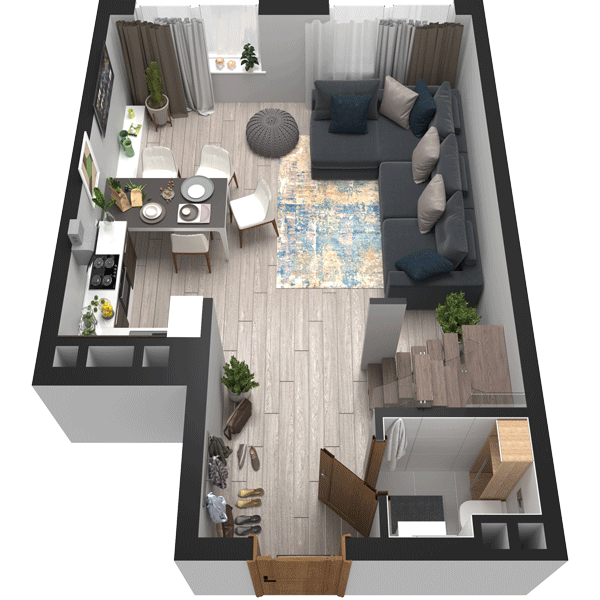

# План квартири 3K2

| Тип | Загальна площа | Житлова площа |
| --- | -------------- | ------------- |
| 3K2 | 94,03          | 44,81         |

| Приміщення   | Площа |
| ------------ | ----- |
| 1.Кімната    | 20,66 |
| 2.Кухня      | 13,26 |
| 3.Санвузол   | 2,39  |
| 4.Передпокій | 9,47  |

## 📁[План приміщення](plan.pdf)

## 📁[План поверху](floor.pdf)