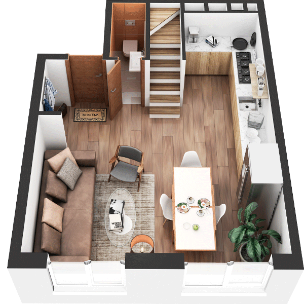

# План квартири 4C1

| Тип | Загальна площа | Житлова площа |
| --- | -------------- | ------------- |
| 4C1 | 140,07         | 70,12         |

| Приміщення       | Площа |
| ---------------- | ----- |
| 1.Кімната        | 18,64 |
| 2.Кухня-вітальня | 18,43 |
| 3.Санвузол       | 2,38  |
| 4.Передпокій     | 6,68  |

## 📁[План приміщення](plan.pdf)

## 📁[План поверху](floor.pdf)