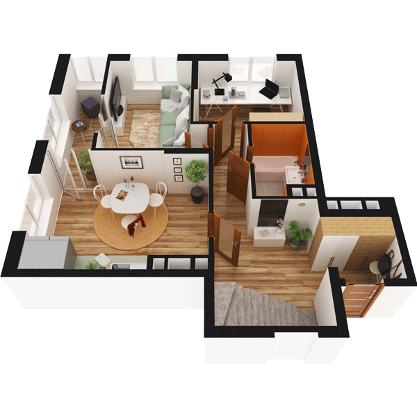

# План квартири 4C2

| Тип | Загальна площа | Житлова площа |
| --- | -------------- | ------------- |
| 4C2 | 122,04         | 48,81         |

| Приміщення                | Площа |
| ------------------------- | ----- |
| 1.Кімната                 | 12,67 |
| 2.Кімната                 | 10,69 |
| 3.Кухня-вітальня          | 19,66 |
| 4.Санвузол                | 4,68  |
| 5.Передпокій              | 18,62 |
| 6.Засклена лоджія (k=1,0) | 5,69  |

## 📁[План приміщення](plan.pdf)

## 📁[План поверху](floor.pdf)