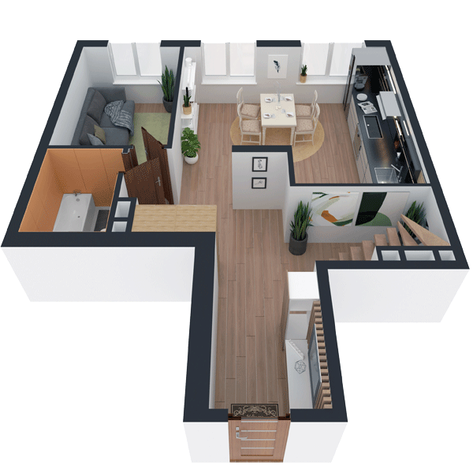

# План квартири 5C1

| Тип | Загальна площа | Житлова площа |
| --- | -------------- | ------------- |
| 5C1 | 139,12         | 65,94         |

| Приміщення       | Площа |
| ---------------- | ----- |
| 1.Кімната        | 15,42 |
| 2.Кімната        | 14,04 |
| 3.Кухня-вітальня | 18,06 |
| 4.Ванна кімната  | 5,30  |
| 5.Передпокій     | 24,98 |

## План приміщення

<iframe src="plan.pdf" width="100%" height="620" style="border:none;"></iframe>

[⬇ Завантажити план приміщення](plan.pdf){ .md-button }

## План поверху

<iframe src="floor.pdf" width="100%" height="620" style="border:none;"></iframe>

[⬇ Завантажити план поверху](floor.pdf){ .md-button }