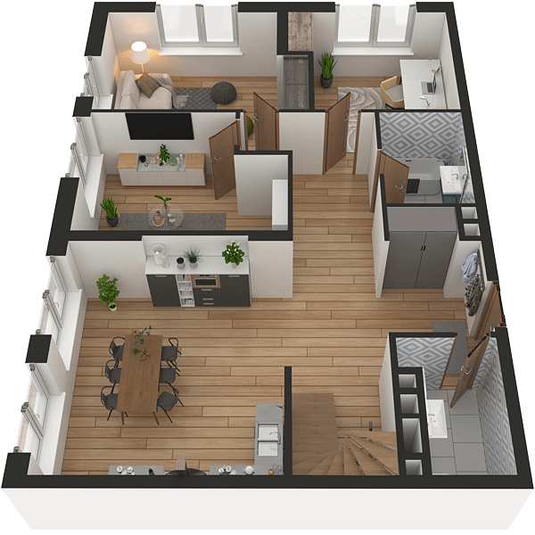

# План квартири 5C2

| Тип | Загальна площа | Житлова площа |
| --- | -------------- | ------------- |
| 5C2 | 147,97         | 75,04         |

| Приміщення       | Площа |
| ---------------- | ----- |
| 1.Кімната        | 14,50 |
| 2.Кімната        | 12,72 |
| 3.Кімната        | 11,33 |
| 4.Кухня-вітальня | 21,74 |
| 5.Ванна кімната  | 4,55  |
| 6.Санвузол       | 3,95  |
| 7.Гардеробна     | 1,17  |
| 8.Передпокій     | 20,30 |

## 📁[План приміщення](plan.pdf)

## 📁[План поверху](floor.pdf)