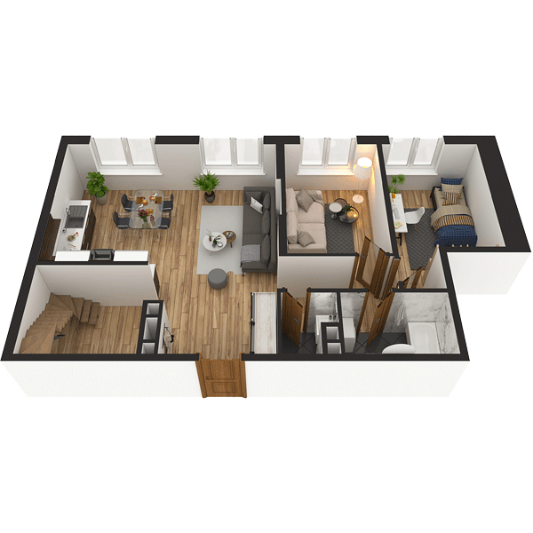

# План квартири 6K1

| Тип | Загальна площа | Житлова площа |
| --- | -------------- | ------------- |
| 6K1 | 158,71         | 85,25         |

| Приміщення      | Площа |
| --------------- | ----- |
| 1.Кімната       | 16,37 |
| 2.Кімната       | 12,30 |
| 3.Кімната       | 13,67 |
| 4.Кухня         | 12,91 |
| 5.Ванна кімната | 5,04  |
| 6.Санвузол      | 2,16  |
| 7.Передпокій    | 20,51 |

## 📁[План приміщення](plan.pdf)

## 📁[План поверху](floor.pdf)